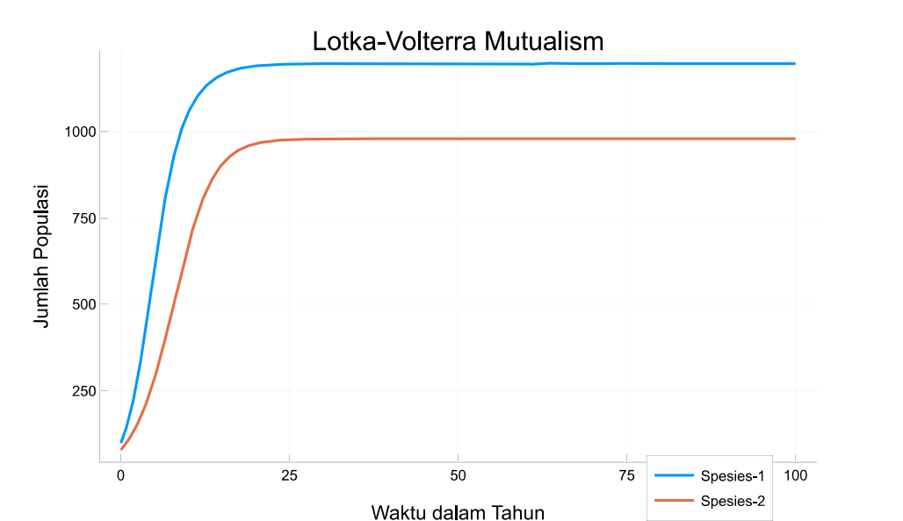
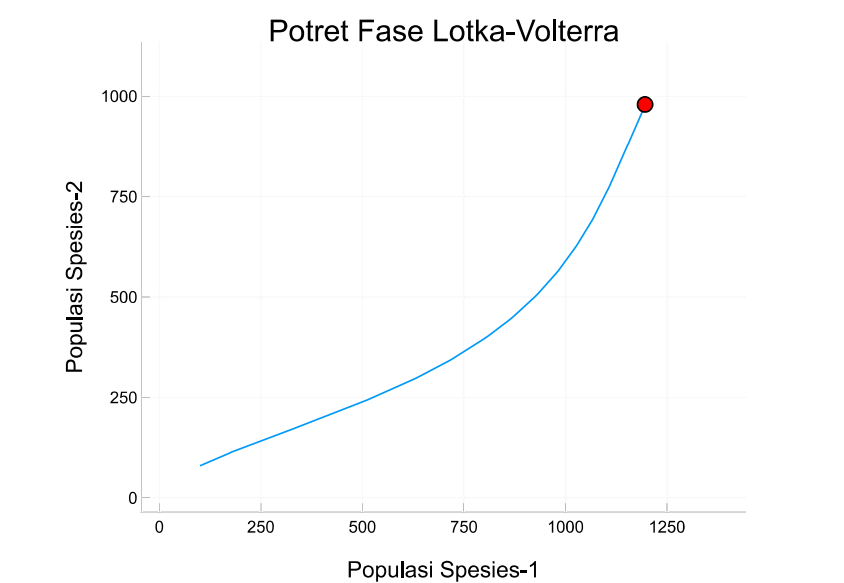

# LotkaVolterraMutualism
🌿 Model interaksi dua spesies yang saling menguntungkan dengan sistem Lotka-Volterra. 📊 Termasuk simulasi numerik, analisis kestabilan, dan visualisasi 🌀 menggunakan Julia.

# Model Mutualisme Lotka-Volterra

Repositori ini berisi implementasi model mutualisme Lotka-Volterra dalam bahasa Julia. Model ini digunakan untuk menggambarkan dinamika dua spesies yang saling menguntungkan satu sama lain.

## 📘 Persamaan Model

Sistem ini dijelaskan melalui persamaan diferensial berikut:

dN₁/dt = r₁·N₁·(1 - N₁/K₁ + b₁₂·N₂/K₁)

dN₂/dt = r₂·N₂·(1 - N₂/K₂ + b₂₁·N₁/K₂)

**Keterangan parameter:**
- `N₁`, `N₂` : ukuran populasi spesies 1 dan 2 🐛🌱  
- `r₁`, `r₂` : laju pertumbuhan intrinsik 📈  
- `K₁`, `K₂` : kapasitas dukung (carrying capacity) 🌾  
- `b₁₂`, `b₂₁` : koefisien mutualisme antar spesies 🤝

## ✨ Fitur Utama

- 🔧 **Parameter Interaktif**: Ubah kondisi awal dan parameter model secara interaktif (misalnya menggunakan Pluto.jl)
- 🧮 **Simulasi Numerik**: Menyelesaikan sistem menggunakan [`DifferentialEquations.jl`](https://diffeq.sciml.ai/)
- 📊 **Analisis Stabilitas**: Menentukan titik tetap dan menganalisis kestabilannya melalui nilai eigen
- 📈 **Visualisasi**:
  - Dinamika populasi terhadap waktu
  - Potret fasa (phase portrait) untuk melihat interaksi antar spesies

## 📊 Contoh Hasil

### Dinamika Populasi


### Potret Fasa


> Titik tetap stabil ditemukan pada **[1195.87, 979.38]** dengan parameter default.

## 🚀 Cara Penggunaan

### Instalasi Paket

Pastikan Julia sudah terinstal, lalu pasang paket-paket berikut:

```julia
using Pkg
Pkg.add(["DifferentialEquations", "Plots", "ForwardDiff", "LinearAlgebra"])
```

## 📚 Referensi
May, R.M. (1976). Simple mathematical models with very complicated dynamics. Nature.

Holland, J.N., DeAngelis, D.L. (2010). A consumer-resource approach to the density-dependent population dynamics of mutualism. Ecology.

## 👨‍💻 Pengembang
Dikembangkan oleh [Dwiki Febrian], 2025.
